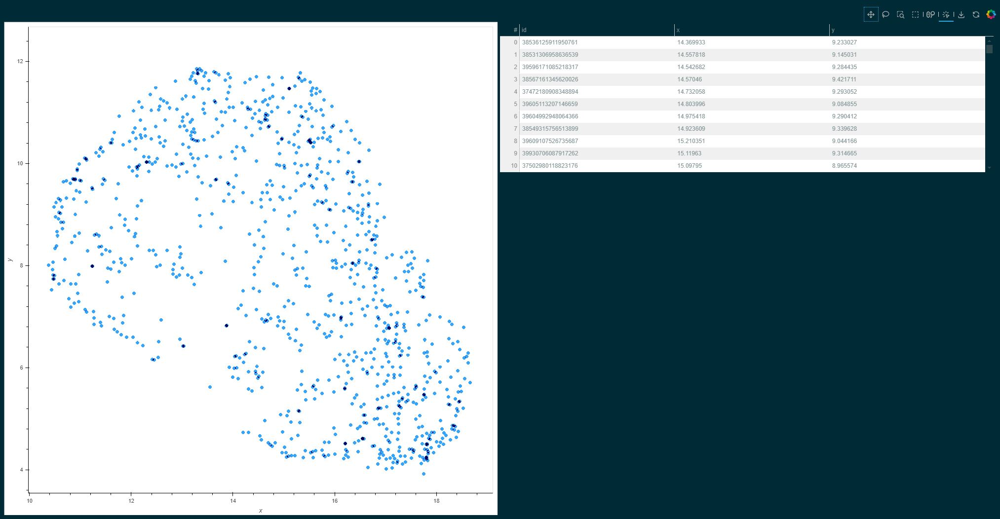

Welcome to Hyrax's documentation!
=================================

Hyrax - A framework for machine learning in astronomy
-----------------------------------------------------
Hyrax is a powerful and extensible machine learning framework that automates data
acquisition, scales seamlessly from laptops to HPC, and ensures reproducibility 
— freeing astronomers to focus on discovery instead of infrastructure.

Getting Started
==================
To get started, we recommend creating a virtual environment (e.g., venv or conda) and installing Hyrax using ``pip``.

.. code-block:: console

   >> conda create env -n hyrax python=3.10
   >> conda activate hyrax
   >> pip install hyrax

With Hyrax installed in your environment, you can train a built in autoencoder right away.

.. tabs::

    .. group-tab:: Notebook

        .. code-block:: python

           from hyrax import Hyrax

           # Create an instance of the Hyrax object
           f = Hyrax()

           # Train the default autoencoder model
           f.train()

    .. group-tab:: CLI

        .. code-block:: bash

           >> hyrax train

Without any additional specification, the model is trained using the
`CiFAR dataset <https://www.cs.toronto.edu/~kriz/cifar.html>`_.

Once the model is trained, we can immediately use it for inference.

.. tabs::

    .. group-tab:: Notebook

        .. code-block:: python

           # Infer on the CiFAR test dataset
           f.infer()

    .. group-tab:: CLI

        .. code-block:: bash

           >> hyrax infer

Hyrax will automatically use the most recently trained model to infer on the CiFAR test dataset.

The results of inference will be 64 element floating point vectors saved as .npy
files in a timestamped directory under the default ``./results/`` directory.

To visualize the results, we should created an embedded lower dimensional space.

.. tabs::

    .. group-tab:: Notebook

        .. code-block:: python

           # Create a 2D UMAP representation of the 64 element vectors
           f.umap()

    .. group-tab:: CLI

        .. code-block:: bash

           >> hyrax umap

The `UMAP <https://umap-learn.readthedocs.io/en/latest/>`_ algorithm is used to
create a 2D representation of the 64 element vectors.
The results of using UMAP can then be examined with an interactive visualization
withing a Jupyter notebook.

.. code-block:: python

   # Visualize the UMAP results
   f.visualize()

   An example UMAP visualization of the CiFAR dataset.

This example shows how Hyrax can be used to quickly train, infer, and visualize
data.
To dive deeper, start with the :doc:`Configuration <configuration>`
section to learn how to configure Hyrax for your specific use case.

.. toctree::
   :hidden:

   Getting started <self>
   Configuration <configuration>
   Verbs <verbs>
   External libraries <external_libraries>
   Data set splits <data_set_splits>
   Model evaluation <model_evaluation>
   Architecture overview <architecture_overview>
   Developer guide <dev_guide>
   API Reference <autoapi/index>
   Example notebooks <notebooks>
   About <about>
